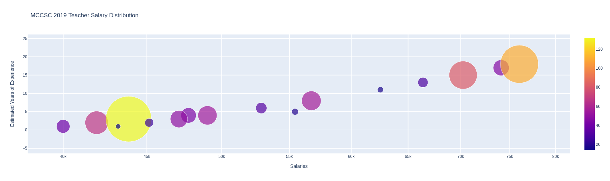

# ✨MCCSC Salary Spread 2019-2020 👩‍🏫

#### This directory was created to:
* practice creating graphs in Python's Plotly library.
* to create a rough website on Github using a free Bootstrap template.

#### The data for the Plotly graphs come from MCCSC's (Monroe County Community School Corporation) [budget website]().   
The graphs provide a visual for the spread and nature of employee salaries and experience.    

